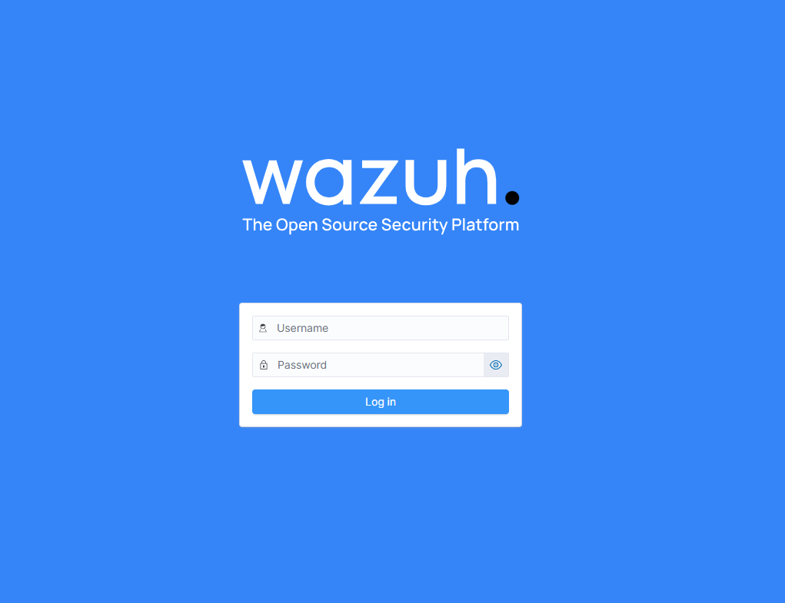
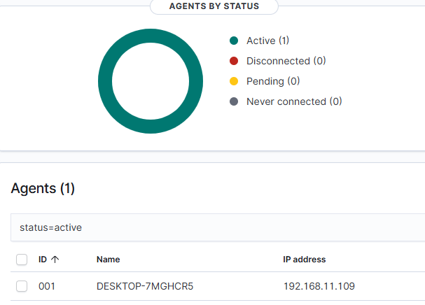
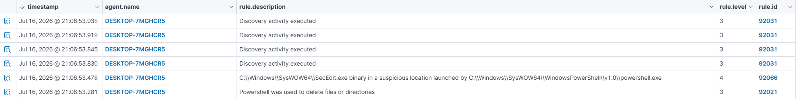
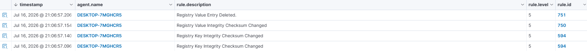
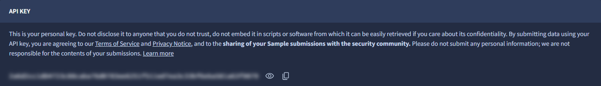
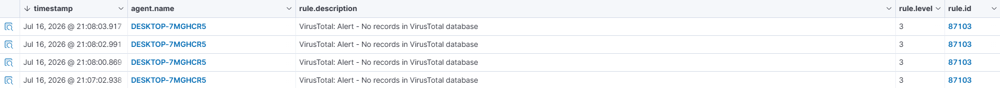
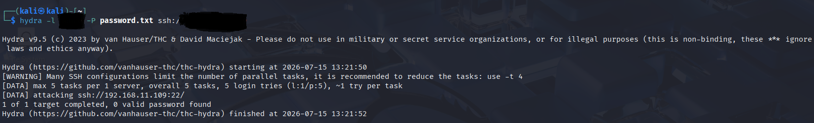
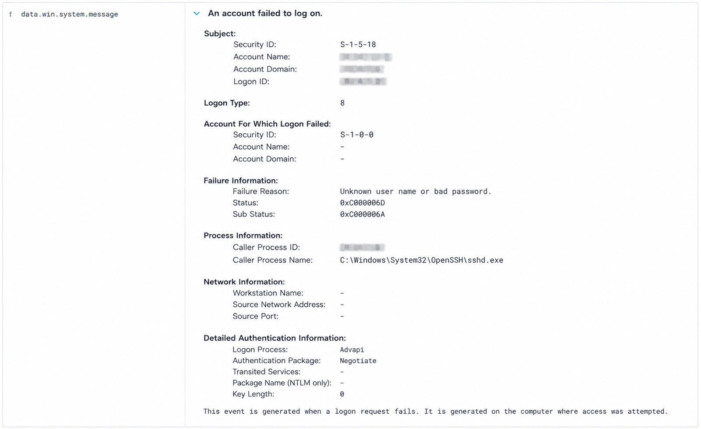

# Wazuh_SOC_Lab 

In this project, we demonstrate a Security Operations Center (SOC) home lab built to simulate real-world security monitoring, threat detection, and incident investigation.

---

# 📌 Objectives

Throughout this project I aimed to:

- Deploy and configure a Wazuh SIEM environment
- Centralize Windows security logs
- Collect detailed endpoint telemetry using Sysmon
- Monitor file modifications with File Integrity Monitoring (FIM)
- Integrate VirusTotal for threat intelligence enrichment
- Simulate attacker techniques using Kali Linux
- Investigate alerts generated inside the Wazuh Dashboard

# 🏗️ Lab Architecture 

# 🖥️ Technology Used
- Wazuh (open-source Security Information and Event Management Platform)
- File Integrity Monitoring (FIM)
- VirusTotal (Threat Intelligence)
- Sysmon (Enhanced Windows Monitoring)
- VMware Workstation
- Kali Linux (Penetration Testing Linux distribution)
- Windows 10 (OS target Machine)
- Ubuntu Server/Desktop (Wazuh Manager)

# 🛡️ Deploying Wazuh:

The first stage consisted of deploying the Wazuh Manager inside an Ubuntu virtual machine using the official installation package.

The deployment included:

- Wazuh Manager
- Wazuh Indexer
- Wazuh Dashboard

After installation, all Wazuh services were verified before accessing the web dashboard.

# Configuring the Windows Endpoint

The Windows 10 endpoint was configured to communicate securely with the Wazuh Manager.

This included:

- Installing the Wazuh Agent
- Registering the agent
- Verifying connectivity
- Forwarding Windows Event Logs

# Sysmon Integration

To increase endpoint visibility, Sysmon was deployed on the Windows endpoint.

Sysmon provides advanced detailed telemetry such as:

- Process Creation
- Network Connections
- Driver Loading
- Registry Changes
- File Creation
- PowerShell Activity

These events were forwarded to Wazuh for analysis.

# File Integrity Monitoring (FIM)

Wazuh File Integrity Monitoring was configured to monitor selected directories for unauthorized modifications.

The lab validates detection of:

- File Creation
- File Modification
- File Deletion

Real-time monitoring allows immediate alert generation whenever monitored files change.

# VirusTotal Integration

VirusTotal was integrated into Wazuh using the public API.

Whenever suspicious files are detected, Wazuh automatically queries VirusTotal and enriches the alert with reputation information.

This allows faster triage during investigations.

# 🔐 Attack Simulation
To validate detections, attacks were launched from a Kali Linux virtual machine.

The objective was not exploitation, but generating realistic security events for analysis.

Attack scenarios included:

- SSH Password Brute Force (Hydra)
- Failed Authentication Attempts
- File Modifications
- Suspicious Process Execution

# 🚨 Detection & Investigation

After Brute force attacks were executed, alerts were investigated using the Wazuh Dashboard.

Examples of monitored activity include:

- Hydra generated multiple failed authentication attempts.

- Wazuh generated rule 5.

- Timeline confirmed repeated login failures within seconds.

- No successful authentication occurred.

Each alert includes:

- Timestamp
- Severity Level
- Source Endpoint
- Event Details

# 📝 Lessons Learned

Building this lab required extensive troubleshooting beyond simply deploying the tools.

Some challenges included:

- Resolving Wazuh agent registration issues
- Troubleshooting network connectivity between virtual machines
- Validating Sysmon log forwarding
- Testing VirusTotal integration
- Verifying alert generation after simulated attacks

Working through these issues improved my understanding of SIEM deployment, endpoint monitoring, Windows logging, and troubleshooting in a SOC environment.
 
